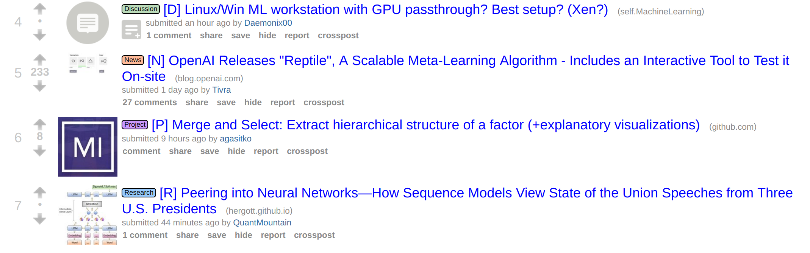

## Reddit Machine Learning: Tagging Challenge

This competition is **hosted** and **run** for free using [github](https://github.com/) and [travis-ci](https://travis-ci.org)!

Deadline: 1st of July 2018

---

### Description

The task is to learn to automatically assign one of the tags (Research, Project, News, Discussion) to each title of [/r/MachineLearning](https://reddit.com/r/MachineLearning).

The data has been gathered from this [public BigQuery dataset](https://bigquery.cloud.google.com/dataset/fh-bigquery:reddit_posts).

  

It is useful to learn a classifier for 2 reasons:

- Automatically classify new posts
- Classify posts in the past that do not have tag

All you have to do is implement a `sol.py` (see here for an example) and do a pull request!
See [How To Compete](#how-to-compete) for the full flow.

### Prize

The top 3 is listed on this repo at the end of the deadline:

| **#**  | **Name**  |  **Score** |
|----|---|---|
| 1  | [kootenpv\_classical\_nlp](https://www.travis-ci.org/kootenpv/reddit_ml_challenge/jobs/351012680)  | 0.6284  |
| 2  | [kootenpv\_simple\_neural](https://www.travis-ci.org/kootenpv/reddit_ml_challenge/builds/351095084)  | 0.5629  |
| 3  | -  | - |

You can also check out the [full leaderboard](full_leaderboard.md)

Maybe the subreddit hosters can use the model?

### How to compete?

One of the example solution just takes 14 lines of Python.

- Fork the repository on Github.
- `mkdir challenge/solutions/my_solution`
- Adapt `challenge/solutions/kootenpv_classical_nlp/sol.py` and save it in your `my_solution` folder
- Commit and push
- Open up a pull request
- The build system will automatically score your solution

### Want to make changes to the build?

Include changes in the `Dockerfile`. I'm not guaranteeing it will be accepted, but you can try :) Changes will not be "reasonably withheld".

### Local development flow

Make changes in your `solutions/` folder and run:

    docker build -t reddit_ml_challenge . && docker run --rm -it reddit_ml_challenge

If you do not want to use docker you can also try to just run:

    cd challenge
    ls -1rtd solutions/** | tail -n 1 > solution_test.txt
    pytest -s test_solution.py

But please do make sure it is compatible with the format of the challenge when submitting.

### Attribution

If you also want to run such a challenge, it would be cool if you refer to this project :)
